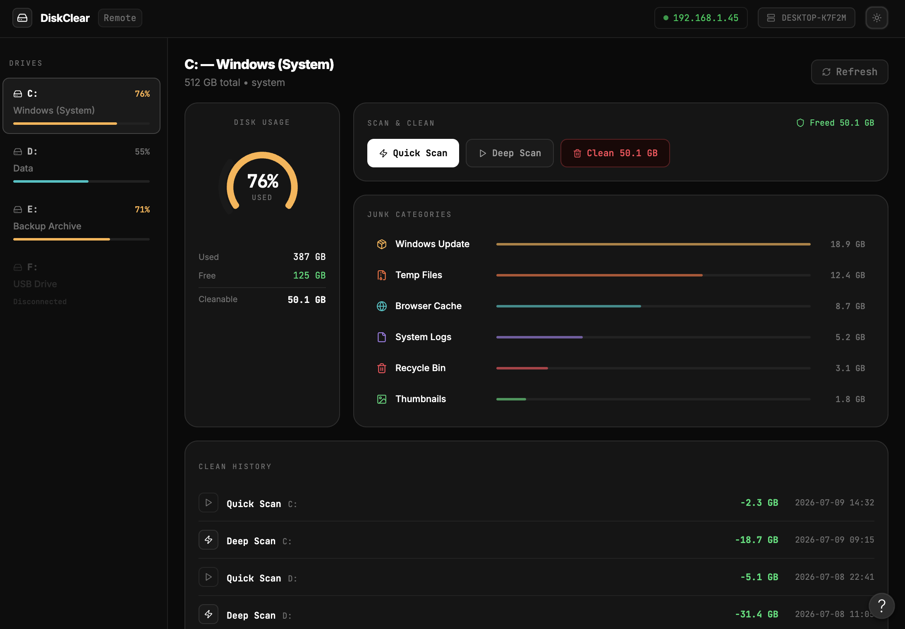
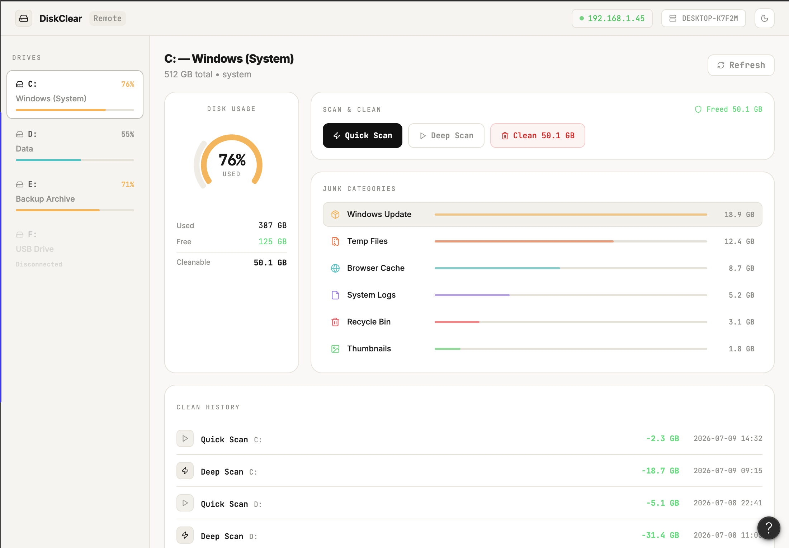

# Miransas Control

A modern Windows optimization, privacy, and maintenance utility built with C++23.

## Features

* Improve Windows privacy
* Disable telemetry and tracking features
* Remove unnecessary Windows components
* Clean temporary and cache files
* Optimize performance
* Manage startup applications and services
* Create restore points before changes
* Fully native Windows application
* Language toggle with English and Uzbek support

## Language Support

The application now includes a simple language toggle so the UI can switch between English and Uzbek text.

## Screenshots

## Privacy

Miransas Control **does not collect any personal data**.

* No analytics
* No telemetry
* No advertisements
* No background tracking
* No cloud synchronization
* No user accounts

Everything runs locally on your computer.

## Open Source

This project is developed as a hobby and learning project. Everyone is welcome to inspect the source code, report issues, and contribute.

## Warning

Some features modify Windows system settings.

Always create a restore point before applying changes.

Use at your own risk.

## License

MIT License

# Miransas Control

C++23 yordamida yaratilgan zamonaviy Windows optimizatsiya va maxfiylik dasturi.

## Imkoniyatlar

* Windows maxfiyligini yaxshilash
* Telemetriya va kuzatuv funksiyalarini o‘chirish
* Keraksiz Windows komponentlarini olib tashlash
* Vaqtinchalik fayllarni tozalash
* Tizim unumdorligini oshirish
* Avtomatik ishga tushadigan dasturlarni boshqarish
* O‘zgarishlardan oldin tiklash nuqtasi yaratish
* Ingliz va O‘zbek tillari o‘rtasida til almashinuvi

## Til yordami

Ilova endi UI matnlarini ingliz va o‘zbek tillarida almashishga imkon beruvchi oddiy til tugmasiga ega.

## Ekran rasmlari

<!-- 

 -->

## Maxfiylik

Miransas Control **hech qanday shaxsiy ma'lumotlarni yig'maydi**.

* Analitika yo‘q
* Telemetriya yo‘q
* Reklama yo‘q
* Yashirin kuzatuv yo‘q
* Bulut sinxronizatsiyasi yo‘q
* Hisob talab qilinmaydi

Barcha amallar faqat sizning kompyuteringizda bajariladi.

## Ochiq manba

Ushbu loyiha hobbiy va o‘rganish maqsadida yaratilgan. Har kim kodni ko‘rishi, xatolar haqida xabar berishi yoki hissa qo‘shishi mumkin.

## Ogohlantirish

Ba'zi funksiyalar Windows tizim sozlamalarini o‘zgartiradi.

O‘zgarishlarni qo‘llashdan oldin tiklash nuqtasini yaratish tavsiya etiladi.

## Litsenziya

MIT License
